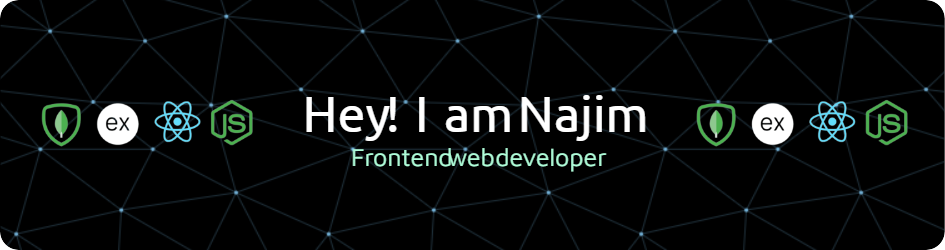

<h2 align="center">About Me</h2>

I'm a passionate web developer specializing in frontend development with a strong focus on delivering user-friendly and efficient solutions. I enjoy turning complex designs into intuitive and responsive applications. I am constantly learning and exploring new technologies to enhance my skills and contribute effectively to the tech community.

<h2 align="center">Skills</h2>

### Front-End

### Back-End

### Authentication

### Tools

 

<h2 align="center">⚡ Stats ⚡</h2>

  <!-- Two-column layout with equal height cards -->
  <table>
    <tr>
      <td valign="top" width="50%">
        <!-- General Stats -->
        <h3 align="center">General Stats</h3>
        
      </td>
      <td valign="top" width="50%">
        <!-- Top Languages -->
        <h3 align="center">Top Languages</h3>
        
      </td>
    </tr>
    <tr>
      <td colspan="2" align="center">
        <!-- Streak Stats spanning two columns -->
        <h3 align="center">Streak Stats</h3>
        
      </td>
    </tr>
  </table>

